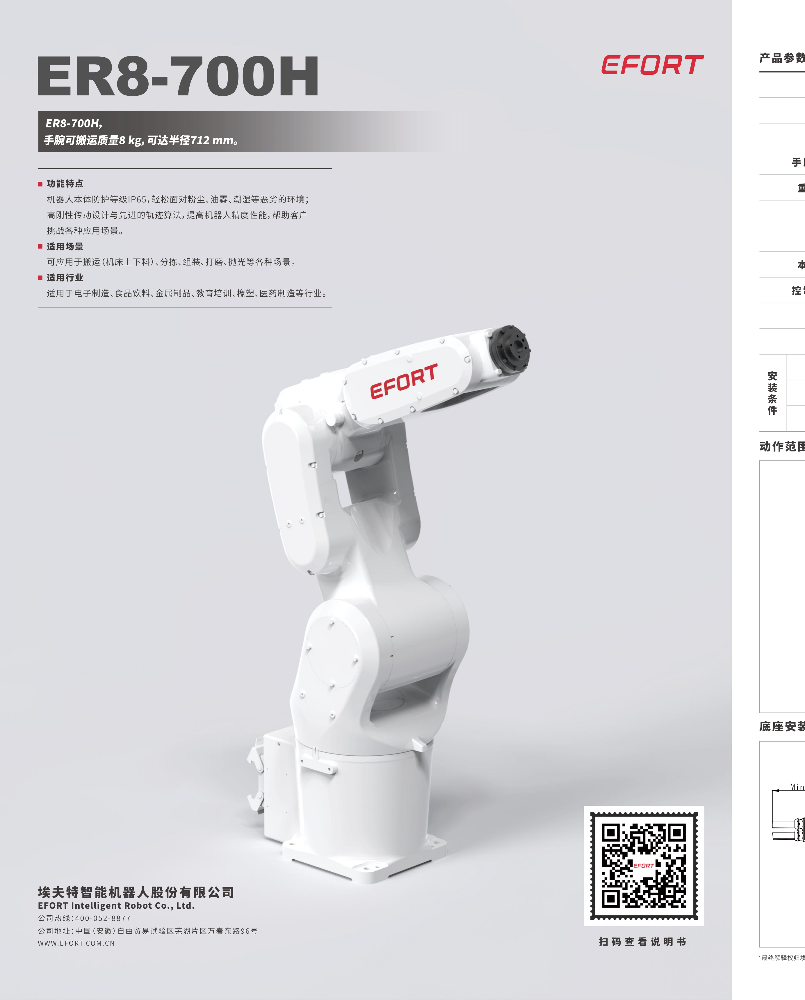
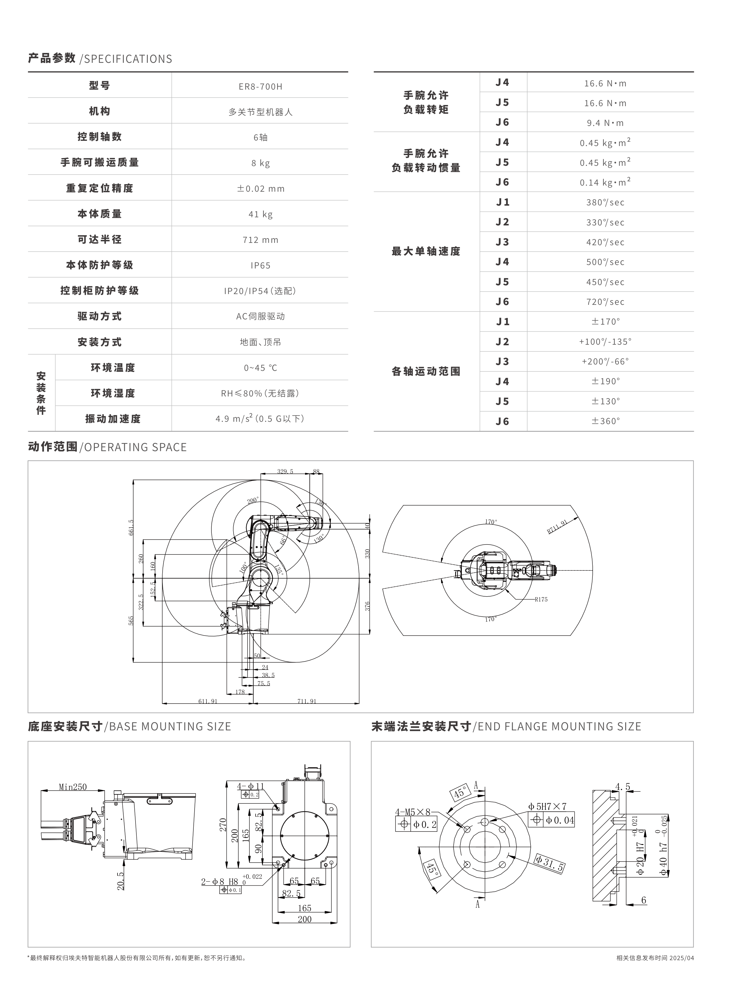
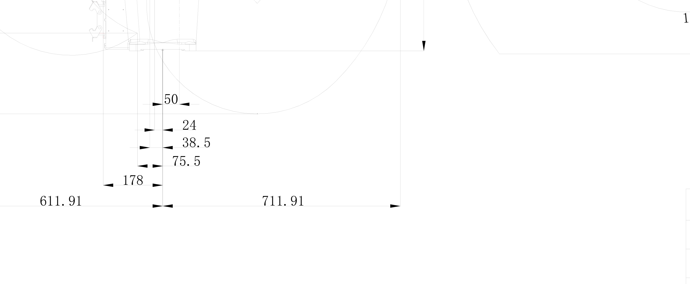
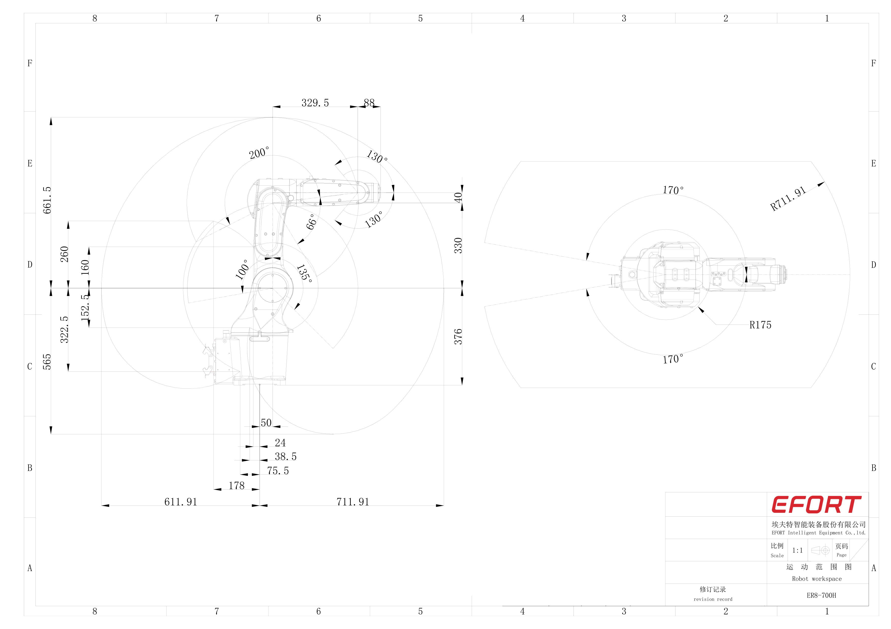
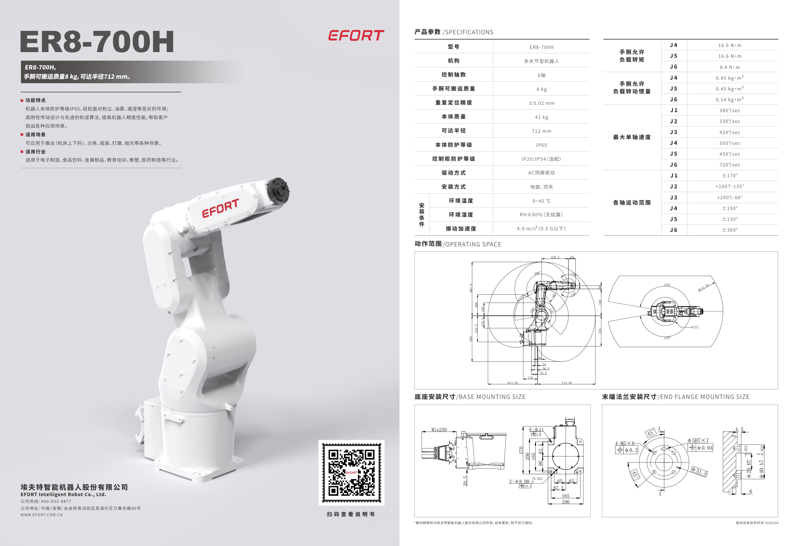

# EfortSimulationRobot

埃夫特 **ER8-700H** 六轴工业机器人 · **全栈网页端三维实时监控与仿真系统**。

> **关于本项目（About）**：基于 Modbus TCP 读取真实控制器数据、用 Three.js 按官方 DH 参数驱动
> **STEP 数模导出的 GLB**，在浏览器里 1:1 还原机器人并实时跟随；支持关节/机器人（笛卡尔六自由度）
> 双模式操控、轨迹录制回放、工业安全围栏四级报警、海康工业相机 + YOLO 视觉检测。
> 后端 FastAPI + WebSocket，前端 Vue3 + Pinia + Three.js，相机独立进程 MJPEG 推流。

| 项目图片 · ER8-700H 官方数模渲染与规格 | |
|---|---|
|  |  |
| **渲染主视图（ds_full）** | **左视图（ds_left）** |
|  |  |
| **右视图（ds_right）** | **底部视角（z_bottom）** |
|  |  |
| **运动范围图（motion range）** | **官方数据手册首页（PDF：[ER8-700H_datasheet.pdf](assets/cad/ER8-700H_datasheet.pdf)）** |

> 完整素材：`assets/cad/`（12 张图 + 2 份 PDF：数据手册 / 运动范围）。

后端通过 Modbus TCP 读取机器人关节角 (J1–J6) → 正运动学计算 TCP → WebSocket 实时推送；
前端用 Three.js 按 DH 参数驱动 **官方 STEP 数模导出的 GLB**，真实还原机器人形态并实时跟随。
> ⚠️ **不是纯只读系统**：默认（双闸关闭）只读不写；双闸打开后 `/api/control/*` 会真机下发。
> 完整的写入权限与安全约束见 [§8.2 写入权限与双闸](#82-控制--运动学-apicontrol)。
内置工业安全围栏（区域越界 + 地面碰撞四级报警）、实验室场景、离线模拟演示、录制回放与视觉检测。

---

## 〇、项目速览（About）

| 项 | 内容 |
|---|---|
| **名称** | EfortSimulationRobot |
| **对象** | 埃夫特 ER8-700H 六轴工业机器人（负载 8kg / 臂展 700mm，见 `assets/cad/ER8-700H_datasheet.pdf`） |
| **形态** | FastAPI 后端(:8000) + Vue3/Three.js 前端 + 独立相机服务(:8100) + SQLite(WAL) |
| **通信** | Modbus TCP 192.168.1.12:502（读位姿常态 20Hz；写指令需"双闸 + 控制令牌"） |
| **三维** | 官方 STEP 数模 → GLB；按 DH 参数建立运动链；智能剖切 / 实验室场景 / 安全围栏 |
| **操控** | 关节模式（J1–J6 滑条）/ 机器人模式（机器人坐标系六自由度 X/Y/Z + A/B/C，IK 整臂联动） |
| **视觉** | 海康 MV-CU120-10GM GigE 相机 MJPEG 实时流 + YOLO 目标检测（按需加载/一键释放） |
| **安全** | 围栏四级阈值(安全/接近/危险/碰撞) + 最低点离台面高度检测 + 双闸写入 + 控制令牌 + 急停 |

---

## 一、功能特性

| 模块 | 能力 |
|---|---|
| **真实监控** | Modbus TCP 20Hz 推送，关节角 + TCP + 速度实时显示；机器人离线时自动切换为前端本地演示（不中断画面） |
| **模拟仿真** | 6 轴滑条 + 键盘精确操控；关节/机器人两种操控模式（关节角 ↔ 世界坐标 XYZ/姿态）；正逆运动学预演 |
| **录制回放** | 后端 `/api/recordings` 提供轨迹序列入库 / 改名 / 导出 / 导入 JSON；**前端回放视图已于阶段 7 下线**（`RecordingView` 已删除），当前 UI 未接入 |
| **视觉检测** | 海康 MV-CU120-10GM GigE 工业相机 MJPEG 实时流 + YOLO 目标检测，可截图存档；检测模型按需加载、可一键释放内存；以**悬浮小面板**内嵌于「真实监控」右上角，可展开/收起 |
| **安全围栏** | 矩形 / 任意四边形 / 圆形多区域，各自四级阈值（安全/接近/危险/碰撞）；围栏越界 + 机器人最低点离台面高度双维度检测；玻璃墙、角柱、黄色警示带的完整工业化视觉；配置持久化 + 报警事件时间线 |
| **实验室场景** | 14m × 14m 车间房间（四面墙 / 天花板 / 灯带 / 点光 / 10 组贴墙设备道具）+ 3.6m 环氧自流平工作区 + 拉丝不锈钢设备站台 |
| **智能剖切** | 相机移到房间外侧或屋顶上方时，挡视线的那一面墙 / 天花板自动变半透明（不消失），其余保持实体 |
| **三维姿态平滑** | 真机 20Hz 的跳变被指数平滑成连续运动，视觉上不抖 |

---

## 二、系统架构

```
┌──────────────────────┐  Modbus TCP (FC3 reg10-21 读位姿 / FC6 写指令 —— 见 §8.2 双闸)
│  Robox 控制器         │◄──────────────── 读位姿为常态；写入需双闸 + 控制令牌
│  192.168.1.12:502    │
└──────────────────────┘
            │ J1..J6 (deg)
            ▼
┌──────────────────────────────────────────────────────────────┐
│ backend  FastAPI + uvicorn            :8000                   │
│   services/modbus.py    读寄存器(失败→重连退避)                 │
│   services/kinematics.py 正运动学 FK → TCP 位姿                 │
│   services/collector.py  采样线程: 入库(节流) + 广播             │
│   services/hub.py        WebSocket 连接管理                     │
│   api/  robot / control / recordings / safety / ws              │
│   db/   SQLite(WAL)  pose_history / events / sessions /        │
│                       recordings / safety_events                │
│   同时托管 frontend/dist 静态文件(no-cache)                     │
└──────────────────────────────────────────────────────────────┘
      │ ws://host:8000/ws/pose   {j1..j6, tcp, simulated, t}
      │ http://host:8000/api/*   REST
      ▼
┌──────────────────────────────────────────────────────────────┐
│ frontend  Vue 3 + Pinia + Three.js (单 WebGLRenderer/单场景)   │
│   3 个 Tab 用 v-show 切换 —— 3D 场景常驻，不重建、不闪断        │
└──────────────────────────────────────────────────────────────┘
      │ http://host:8100/{stream,snapshot,status,...}
      ▼
┌──────────────────────────────────────────────────────────────┐
│ camera  camera_service.py (独立进程)   :8100                   │
│   海康 MVS SDK 抓帧 → numpy/PIL → MJPEG；YOLO 按需加载检测      │
└──────────────────────────────────────────────────────────────┘
```

**端口占用**

| 端口 | 服务 | 必需 |
|---|---|---|
| 8000 | 后端 API + WebSocket + 前端静态托管 | 是 |
| 8100 | 视觉检测服务（海康相机 + YOLO） | 否（「真实监控」内的摄像头面板需要） |
| 5173 | Vite 开发服务器 | 否（仅前后端分离开发时） |
| 502 | 机器人 Modbus TCP（外部设备） | 否（连不上自动回退模拟） |

---

## 三、环境要求

| 组件 | 版本 | 说明 |
|---|---|---|
| **Python** | 3.10+（实测 3.13） | 后端；`setup.bat` 自动建 `backend/.venv` |
| **Node.js** | 20+（实测 22） | 前端构建（Vite） |
| 操作系统 | Windows 10/11 | 启动脚本为 `.bat`；后端/前端本身跨平台 |
| 浏览器 | Chrome / Edge 现代版本 | 需支持 WebGL2 与 ES2020 |
| MVS 客户端 | 海康机器人官方 | **仅视觉检测需要**；提供相机 DLL 与 Python 封装 |

> 视觉检测用的是**另一套解释器**（含 PyTorch / ultralytics / MVS 封装），
> 与后端 venv 分开，避免把数 GB 的 torch 塞进后端环境。见「环境变量」。

---

## 四、快速开始

### 4.1 首次安装（一键）

双击根目录 **`setup.bat`**，它会依次完成：

1. 检查 Python / Node 是否就位（版本不达标会明确报错）
2. 创建 `backend\.venv` 并安装 `backend/requirements.txt`
3. 在 `frontend\` 安装 npm 依赖（有 lock 文件时用 `npm ci`）
4. 创建运行时目录 `data\` `logs\` `camera\captures\`
5. 构建前端到 `frontend\dist`
6. 若 `.env` 不存在，从 `.env.example` 复制一份

脚本幂等，可反复运行。

**环境自检**：双击 `scripts\doctor.bat`，逐项列出 PASS / WARN / FAIL 并给出修复提示。

### 4.2 启动

```
run.bat              清理旧进程 + 启动视觉服务 + 后端 + 打开浏览器(推荐)
run.bat backend      只启动后端 :8000
run.bat camera       只启动视觉检测服务 :8100
run.bat stop         停止 8000 / 8100 上占用端口的进程
run.bat build        重新构建前端
run.bat help         查看用法
```

浏览器访问 **http://localhost:8000**

`scripts\start_all.bat`、`scripts\start_backend.bat`、`scripts\start_camera.bat`、
`scripts\build_frontend.bat` 是等价的单功能入口，便于做快捷方式或计划任务。

### 4.3 开发模式（前后端分离，热更新）

```
scripts\start_backend.bat       终端 1：后端 :8000
scripts\start_frontend_dev.bat  终端 2：Vite :5173
```

打开 http://localhost:5173 —— Vite 已把 `/api` 与 `/ws` 代理到 8000，同源免 CORS。

### 4.4 构建产物

`frontend/dist` 由后端以 `no-store` 托管。改完前端执行 `run.bat build`，
浏览器**直接刷新**即可看到新版本（已禁用缓存，无需强刷）。

---

## 五、目录结构

```
EFORT_Web_Monitoring/
├─ setup.bat                 一键安装（Python/Node 依赖 + 构建）
├─ run.bat                   一键启动 / 停止 / 构建
├─ .env.example              环境变量模板（复制为 .env 生效）
├─ config/
│   ├─ robot.yaml            ★ 唯一数据源：DH / 寄存器 / 采样 / 限位 / 安装方式
│   └─ safety.json           安全围栏配置（运行时可改，原子写落盘）
├─ backend/                  FastAPI 后端（独立 venv）
│   ├─ app/
│   │   ├─ main.py           入口：路由挂载 + 静态托管 + 生命周期 + CORS 白名单 / 体积上限 / 日志轮转
│   │   ├─ api/              薄路由层（13 个）：robot · control · recordings · safety · ws ·
│   │   │                    auth · points · programs · events · system · vision · frames · settings
│   │   ├─ core/             config(.env 加载) / app_settings(界面可改的配置表) / deps / exceptions /
│   │   │                    logger(轮转) / middleware / safety_config / brand / frames_config
│   │   ├─ db/                models / database(引擎+WAL+连接串解析) / crud
│   │   ├─ schemas/          Pydantic 出入参
│   │   └─ services/         （15 个）modbus · motion · jog · jog_frames · kinematics · collector ·
│   │                        hub · events · safety_guard · sim_robot · rc_ready · runmode ·
│   │                        camera_client · vision_ingest · vision_rules
│   ├─ scripts/init_db.py    手工建库
│   ├─ tests/                pytest 185 例（13 个文件；见「十、测试与回归」）
│   ├─ requirements.txt      运行依赖
│   └─ requirements-dev.txt  附加 pytest / httpx
├─ camera/                   视觉检测服务（独立进程 + 独立解释器）
│   ├─ camera_service.py     标准库 http.server：MJPEG / 抓帧 / YOLO
│   ├─ models/               .pt 模型目录（yolo26n.pt）
│   ├─ captures/             截图输出
│   └─ requirements.txt      仅视觉侧依赖（numpy / pillow / ultralytics）
├─ frontend/                 Vue 3 + Three.js
│   ├─ index.html            页面骨架 + 全部 CSS（深色工业主题）
│   ├─ vite.config.js        base "./" + dev proxy
│   ├─ public/models/        robot_full.glb ← 官方 STEP 数模导出件
│   ├─ src/
│   │   ├─ main.js           Vue 应用装配 + 全局未捕获错误收集（P1-D5）
│   │   ├─ config.js         WS/API 地址推断（姿态流 / 事件流分开）+ 兜底 DH + 相机地址
│   │   ├─ App.vue           页面框架 / 报警条 / 语音播报 / 快捷键 / 事件流订阅
│   │   ├─ tabs.js · shortcuts.js · linkview.js · guide.js · brand.js
│   │   │                    ↑ 纯函数（导航与快捷键解析 / 状态灯取色 / 指引文案 / 品牌名）
│   │   ├─ three/
│   │   │   ├─ manager.js    ★ 单场景管理器：模型装配 / 姿态平滑 / 视角 / 上下文丢失恢复
│   │   │   ├─ safety.js     ★ 围栏引擎：多边形间距 / 四级分级 / 报警垫
│   │   │   ├─ lab.js        ★ 实验室房间 + 智能剖切
│   │   │   ├─ cell.js       ★ 工作区地坪 + 设备站台（黄黑警示带）
│   │   │   └─ ghost.js · jointOwner.js · simObjects.js   残影预演 / 关节归属 / 沙盘道具
│   │   ├─ net/              control.js（带令牌的 API 封装）· ws.js（姿态流客户端）
│   │   ├─ components/       （20 个）MonitorLayout · RealMonitor · SimMonitor ·
│   │   │                    PointExecView · ProgramExecView · SettingsView · EventsView · AboutView ·
│   │   │                    RobotParamsCard · ExecControlCard · RcReadyCard · CameraPanel ·
│   │   │                    SafetyPanel · SafetyChip · StatusStrip · GuideBar · AnnouncePanel ·
│   │   │                    RobotProgramPanel · SimObjectsPanel · Icon
│   │   │                    （阶段 7 已删除 RecordingView / JointHud：回放 UI 下线，见 §一）
│   │   ├─ stores/           （9 个 store + 1 个纯函数模块）robot · safety · camera · exec(执行域) ·
│   │   │                    auth(令牌) · link(自检轮询) · rcReady · settings · ui
│   │   │                    + poseAuthority.js（姿态权威优先级，纯函数）
│   │   │                    （阶段 7 已删除 recording store）
│   │   └─ utils/            alarm(Web Audio 蜂鸣) / dance / jointScale(限位条宽) / safetyConfig / safetyLabels
│   └─ tools/                ★ 无头回归测试 22 个 .mjs（npm run verify）
├─ docs/                     方案与设计文档
├─ assets/cad/               官方手册 / 运动范围图 / 数模原件
├─ data/                     robot.db（运行时生成）+ STEP 数模原件
└─ logs/                     运行日志
```

---

## 六、配置

### 6.1 机器人配置 `config/robot.yaml`

机型相关的**唯一数据源**，换机型只改这一个文件：

| 段 | 作用 |
|---|---|
| `robot` | 型号 / 序列号 / 负载 / 臂展（信息展示） |
| `connection` | Modbus 主机、端口、unit_id、超时、`simulate`(auto/always/never) |
| `modbus` | 功能码、起始寄存器、数量、单位、字序（`swap` = 高字在后） |
| `axis_sign` | 6 轴符号，某轴方向与真机相反时改成 `-1`（全链路一致生效） |
| `joint_limits` | 关节行程限位（前端 clamp + 量程显示） |
| `dh` | **DH 参数**：`d / a / alpha / theta_offset`，决定三维形态与 FK 精度 |
| `mounting` | 安装方式 `floor / wall / ceiling` |
| `sampling` | 读取频率、入库频率、推送频率、历史保留天数 |
| `database` / `server` | 库位置（可被环境变量覆盖）/ 监听地址端口 |

### 6.2 安全围栏 `config/safety.json`

运行时可改，通过 API 或界面「安全围栏」面板保存（原子写 + 强校验）。

```jsonc
{
  "enabled": true,
  "zones": [{
    "id": "z1", "name": "主工作区", "enabled": true,
    "shape": "rect",                 // rect | quad | circle
    "center": { "x": 0, "z": 0 },    // rect / circle 圆心
    "half":   { "x": 0.82, "z": 0.82 },  // rect 半宽(m)
    "radius": 0.9,                   // circle 半径(m)
    "corners": [[-0.82,-0.82], ...], // quad 四个角点(m)
    "height": 1.2,                   // 围栏高度(m)
    "walls": true,                   // 该区域是否显示玻璃墙
    "posts": { "enabled": true, "size": 0.1, "color": "#f2c500" },
    "thresholds": {
      "basis": "halfwidth",          // halfwidth(中心到最近边) | fixed_mm(绝对值)
      "warn": 0.3, "danger": 0.1,    // 占用比例阈值
      "fixed_mm": 300.0              // basis=fixed_mm 时的基准
    },
    "colors":  { "safe": "#2ecc71", "warn": "#f2c500", "danger": "#e5484d", "hit": "#ff2020" },
    "opacity": { "safe": 0.11, "warn": 0.2, "danger": 0.3, "hit": 0.45 }
  }],
  "blink": { "hz": 4.0, "min": 0.18, "max": 0.63 },      // 碰撞闪烁
  "alarm": { "banner": true, "chip": true, "banner_min": "danger", "sound": false },
  "walls": true,                       // 全局玻璃墙总开关（关掉仍保留线框+角柱）
  "ground": {                          // 地面/台面碰撞检测
    "enabled": true,
    "warn_mm": 150, "danger_mm": 80, "hit_mm": 30,       // 必须满足 hit ≤ danger ≤ warn
    "colors":  { ... }, "opacity": { ... }
  },
  "overlay": { "bbox": false },        // 显示围栏包围盒线框
  "camera":  { "position": [...], "target": [...] }       // 保存的视角
}
```

> **地面报警垫的形状跟随第一个启用区域的轮廓**（矩形/四边形/圆形均可），
> 机器人站在设备站台上时，零点自动对齐**台面**而非房间地坪，
> 读数含义是「机器人最低点离台面的高度」。

---

## 七、环境变量

复制 `.env.example` 为根目录 `.env`。**已存在的系统环境变量优先，`.env` 不会覆盖它**；
不建 `.env` 时全部使用内置默认值。

| 变量 | 默认 | 作用 |
|---|---|---|
| `EFORT_SIMULATE` | `auto` | `auto` 连不上自动回退模拟 / `always` 强制模拟 / `never` 强制真机 |
| `EFORT_DB_URL` | `sqlite:///data/robot.db` | 覆盖数据库连接串（测试/部署用） |
| `CAMERA_PORT` | `8100` | 视觉检测服务端口 |
| `EFORT_CAMERA_PYTHON` | 参考项目 venv 路径 | 跑视觉服务的解释器（需含 torch/ultralytics/MVS 封装） |
| `EFORT_MVS_SDK_DIR` | 参考项目 MvImport 路径 | `MvCameraControl_class.py` 所在目录 |
| `EFORT_MVS_RUNTIME_DIR` | MVS 标准安装路径 | MVS 运行时 DLL 目录 |

前端构建期变量放 `frontend/.env`（模板见 `frontend/.env.example`），改动后需重新构建：

| 变量 | 默认 | 作用 |
|---|---|---|
| `VITE_CAMERA_PORT` | `8100` | 前端请求视觉服务的端口 |

---

## 八、API 一览

### 8.1 系统 / 姿态（`/api`、`/healthz`）

**门控图例**：`公开` = 无需令牌；`控制` = 限时控制令牌（`X-Control-Token`，`POST /api/auth/login` 取得）；
`管理员` = 控制令牌且角色为 admin；`+双闸` = 还需 `EFORT_REAL_MOTION=1` 且 `motion.real_write=true`（见 8.2）。

| 方法 | 路径 | 门控 | 说明 |
|---|---|---|---|
| GET | `/healthz` | 公开 | 存活探针（不依赖 DB / 机器人） |
| GET | `/api/version` | 公开 | 服务版本信息 |
| GET | `/api/health` | 公开 | 机器人连接状态、模拟标志、采样信息、WS 客户端数 |
| GET | `/api/meta` | 公开 | 机型 / DH / 标定状态 / 关节限位 |
| GET | `/api/pose` | 公开 | 当前姿态（关节角 + TCP + 时间戳） |
| GET | `/api/history?limit=500` | 公开 | 历史姿态 |
| GET | `/api/export/csv?limit=2000` | 公开 | 导出 CSV |
| GET | `/api/rc-status` | 公开 | 控制器寄存器快照（状态字 / 报警 / 程序号） |
| POST | `/api/ready` | 控制 +双闸 | 一键就绪：写 40101 指令字（伺服上电 / 加载 / 运行） |
| POST | `/api/reconnect` | 控制 | 探测并重连 Modbus（真实 ↔ 模拟切换） |

### 8.2 控制 / 运动学（`/api/control`）

除 `/preview`、`/ik` 外，**本组全部要求控制令牌**（router 级 `require_control`）：

| 方法 | 路径 | 门控 | 说明 |
|---|---|---|---|
| GET | `/api/control/limits` | 控制 | 关节限位 + 可达半径 |
| POST | `/api/control/preview` | **公开** | **指令预演**：只算不下发，返回末端位姿与逐段校验 |
| POST | `/api/control/ik` | **公开** | 逆运动学求解（纯计算，不记请求日志） |
| GET | `/api/control/state` `/tcp` `/frames` | 控制 | 引擎状态 / TCP / 坐标帧 |
| POST | `/api/control/move` | 控制 +双闸 | 插值下发到目标位姿（或点位） |
| POST | `/api/control/run-file` | 控制 +双闸 | 执行本地程序 / XPL 文件 |
| POST | `/api/control/run-cancel` | 控制 | 中止正在执行的任务（P0-7） |
| GET | `/api/control/files` | 控制 | 可执行文件清单 |
| POST | `/api/control/jog/step` | 控制 +双闸 | 增量点动（限位夹紧 + 回报 `limit_clamped`） |
| POST | `/api/control/jog/start` `/keepalive` `/stop` | 控制 +双闸 | 连续点动 + 死人开关（1.5s 无保活自动停） |
| GET | `/api/control/jog` | 控制 | 点动状态 |
| POST | `/api/control/estop` `/estop/reset` | 控制 | 软件急停与复位（急停不看连接态，只看令牌） |
| GET / POST / DELETE | `/api/control/run-mode` | 控制 | 示教器档位查询 / 声明 / 撤销 |

> #### ⚠️ 写入权限与「双闸」（审计修复 P1-E9，原表述"本系统对机器人**只读**"已作废）
>
> `/preview` 与 `/ik` 是**纯计算**，不写控制器；但本系统**并非整体只读** —— 上表标 `+双闸` 的接口
> 会写寄存器（Modbus FC6：`40101` 指令字、`40103` 速度、`40104` 程序号、
> `40135` 点动触发位、`40139~44` 目标角），另有 `POST /api/ready`、
> `POST /api/system/reconnect`、`POST /api/reconnect` 也是真机寄存器操作。
>
> **双闸**（`real_write_enabled()`，`services/motion.py`）—— 两者必须**同时**打开才写真机，
> 缺一即退回"只校验 + 记录"的安全模拟：
> 1. 环境变量 `EFORT_REAL_MOTION=1`；
> 2. `config/robot.yaml` → `motion.real_write: true`（或「设置 → 启用真实下发」，需重启后端）。
>
> 另外：所有写接口还要求**限时控制令牌**，匿名请求一律 401/403；
> 围栏 / 坐标帧 / 视觉 / 设置里的高危项需要**管理员**令牌。
> 现场上线前请先确认这两道闸的实际取值（`.env` + `robot.yaml`），详见
> `docs/审计-项目代码审计与优化改进方案.md`。

### 8.3 鉴权（`/api/auth`）

| 方法 | 路径 | 门控 | 说明 |
|---|---|---|---|
| POST | `/api/auth/login` | 公开 | 校验管理员口令换限时控制令牌；**按 IP 限速**（60s 内 20 次失败 → 429） |
| GET | `/api/auth/status` | 公开 | 当前令牌 / 角色 / 剩余 TTL |
| POST | `/api/auth/logout` | 控制 | 释放令牌 |

### 8.4 点位 / 程序（`/api/points`、`/api/programs`）

| 方法 | 路径 | 门控 | 说明 |
|---|---|---|---|
| GET | `/api/points`、`/api/points/{id}`、`/{id}/export` | 公开 | 列表 / 详情 / 导出 |
| POST | `/api/points`、`/{id}`(PUT)、`/{id}`(DELETE)、`/import` | 控制 | 增改删与导入 |
| GET | `/api/programs`、`/api/programs/{id}`、`/{id}/export` | 公开 | 列表 / 详情 / 导出 |
| POST / PUT / DELETE | `/api/programs`、`/{id}` | 控制 | 增改删 |

### 8.5 录制（`/api/recordings`）

| 方法 | 路径 | 门控 | 说明 |
|---|---|---|---|
| GET | `` / `/{id}` / `/{id}/export` | 公开 | 列表 / 详情（含完整帧序列）/ 导出 JSON |
| POST | `` | 控制 | 新建（带 `source`: `real` / `sim`） |
| PUT | `/{id}` | 控制 | 改名 / 更新 |
| DELETE | `/{id}` | 控制 | 删除 |
| POST | `/import` | 控制 | 导入 JSON（受 8 MB 请求体上限约束） |

### 8.6 安全围栏（`/api/safety`）

| 方法 | 路径 | 门控 | 说明 |
|---|---|---|---|
| GET | `/api/safety`、`/default`、`/validate` | 公开 | 读配置 / 出厂默认 / 只校验不落盘 |
| PUT | `/api/safety` | 管理员 | 保存（原子写 + 强校验，非法返回 `SAFETY_CONFIG_INVALID`） |
| POST | `/api/safety/reset` | 管理员 | 恢复出厂（前自动归档） |
| GET | `/api/safety/events` | 公开 | 报警事件时间线 |
| POST / DELETE | `/api/safety/events` | 控制 / 管理员 | 追加 / 清空报警事件 |
| GET / POST | `/api/safety/live` | 控制 / 公开 | 围栏余量实时上报与读取 |
| GET | `/api/safety/versions`、`/{vid}` | 控制 | 配置版本历史 |
| POST | `/api/safety/versions/{vid}/rollback` | 管理员 | 回滚到某个版本 |

### 8.7 审计事件（`/api/events`）

| 方法 | 路径 | 门控 | 说明 |
|---|---|---|---|
| GET | `/api/events`、`/stats`、`/export` | 公开 | 时间线 / 统计（SQL 聚合，P1-C1）/ 导出 |
| DELETE | `/api/events` | 管理员 | 清空审计事件 |

### 8.8 系统与设置（`/api/system`、`/api/settings`、`/api/frames`）

| 方法 | 路径 | 门控 | 说明 |
|---|---|---|---|
| GET | `/api/system/health` `/guide` `/info` | 公开 | 健康 / 链路自检（TCP 探测带 3s TTL 缓存，P1-B8）/ 环境信息 |
| POST | `/api/system/reconnect` | 控制 | 重连控制器 |
| GET | `/api/system/export` | 控制 | 导出配置/数据包 |
| POST | `/api/system/import` | 管理员 | 导入配置包 |
| GET | `/api/settings` `/live` `/summary` | 公开 | 配置描述 / 实时值 / 摘要 |
| PUT | `/api/settings` | 控制 | 改配置（高危项标 `admin=true`） |
| POST | `/api/settings/apply` `/test` | 控制 | 应用（部分需重启）/ 试连接（绕过探测缓存） |
| POST | `/api/settings/reset` `/password` `/control-ttl` | 管理员 | 恢复默认 / 改口令 / 改令牌 TTL |
| GET | `/api/frames` | 公开 | 坐标帧读取 |
| PUT / POST | `/api/frames`、`/teach`、`/reset` | 管理员 | 坐标帧写入 / 示教 / 复位 |

### 8.9 视觉（`/api/vision`）

| 方法 | 路径 | 门控 | 说明 |
|---|---|---|---|
| GET | `/card` `/image` `/last` `/records` `/rules` `/stats` `/export` | 公开 | 画面 / 最新结果 / 记录 / 规则 / 统计 / 导出 |
| DELETE / POST | `/records`、`/records/{rid}/review` | 管理员 | 清空记录 / 人工复核 |
| POST / PUT | `/config` `/background` `/calibrate/*` `/rules` | 管理员 | 配置、白标定、标定采样、规则写入 |

### 8.10 WebSocket

| 协议 | 路径 | 门控 | 说明 |
|---|---|---|---|
| WS | `/ws/pose` | 公开 | 姿态 / 寄存器快照推送（校验 `Origin`、单流上限 64，P1-B6） |
| WS | `/ws/events` | 控制 | **审计事件流**：连接后首条消息发 `{"type":"auth","token":"..."}`；令牌不进查询串（避免落访问日志），失败以关闭码 `4401` 断开 |

### 8.11 视觉检测服务（独立进程 `:8100`）

| 方法 | 路径 | 说明 |
|---|---|---|
| GET | `/stream` | MJPEG 实时流（含检测框） |
| GET | `/snapshot` | 当前单帧 JPEG |
| POST | `/snapshot-save` | 保存到 `camera/captures/` |
| GET | `/status` | 状态（设备 / FPS / AI / 检测耗时 / 模型列表） |
| GET | `/models` | 可用 `.pt` 模型列表 |
| POST | `/open` `/close` | 打开 / 关闭相机（异步，前端轮询 `/status`） |
| POST | `/reconnect` | 手动重连相机（网口切换后无需重启服务） |
| POST | `/config` | 更新 AI 配置 `enabled / model / conf / imgsz` |
| POST | `/unload` | 卸载 YOLO 模型并回收内存 |

---

## 九、界面操作

### 9.1 七个模块（顶部导航）

「没拿到权限就藏起来」由 `src/tabs.js` 纯函数决定，`tools/verify_tabs.mjs` 逐组合钉死；
**入口显隐只是体验，权限边界仍在后端**（`require_control` 401 / `require_admin` 403）。

| # | 模块 | 门控 | 内容 |
|---|---|---|---|
| 1 | **真实监控** | 公开 | 关节读数 + TCP 位姿 + 3D 实时姿态；离线时本地演示轨迹；右上角**摄像头悬浮面板**；左下参数卡（连接状态含**遥测冻结**提示） |
| 2 | **模拟仿真** | 公开 | 6 轴滑条 / 世界坐标操控、指令预演、🕺 跳舞演示、沙盘道具 |
| 3 | **点位执行** | 控制令牌 | 点位列表 / 示教滑块 / 逐点执行 / 连续点动 |
| 4 | **程序执行** | 控制令牌 | 程序分步执行、本地文件执行、执行日志、**中止**、残影预演 |
| 5 | **运维审计** | 管理员 | 审计事件时间线 / 统计 / 导出、围栏配置与版本回滚 |
| 6 | **系统设置** | 控制令牌 | 机器人、连接、采样、数据库、安全、日志等配置（逐字段标注谁能改、是否要重启） |
| 7 | **关于** | 公开 | 实验指导（检查清单 / 流程 / 注意事项 / 异常查表）、快捷键、版本信息 |

底部常驻：**三盏状态灯**（机器人链路 / 摄像头 / 示教器档位）+ 自检引导条 + 控制权限与语音播报开关。

#### 摄像头悬浮面板（真实监控右上角）

- 默认**收起**：只显示小画面缩略图 + 状态点 + 帧率，不占地方；
- 点标题栏**展开**：显示完整控制 —— 打开/关闭相机、↻ 重连相机、启用 YOLO 检测、
  模型选择、置信度/推理尺寸调节、截图存档、释放模型内存；
- 相机画面统一按比例缩放（`object-fit: contain`），不放大不裁切；
- 相机服务（`:8100`）由 `run.bat` 或 `run.bat camera` 启动，服务未运行时会提示。

### 9.2 快捷键

唯一事实来源是 `src/shortcuts.js`（`SHORTCUTS`），界面提示与「关于」页都读它；
解析规则由 `tools/verify_shortcuts.mjs` 逐上下文钉死。**任何页面生效，除非另有说明**。

| 按键 | 分组 | 作用 | 需令牌 |
|---|---|---|---|
| `1` ~ `7` | 导航 | 从左到右切到第 N 个**可见**模块（无权限的模块不显示，序号顺延） | 否 |
| `E` | 视图 | 展开 / 收起侧面板 | 否 |
| `Q` | 视图 | 显示 / 隐藏摄像头画面 | 否 |
| `空格` | 执行 | 运行 / 停止程序（**仅「程序执行」页**；空闲时重复运行已选中的那一个） | 是 |
| `Esc` | 安全 | **急停**：立即停止一切运动并锁定（有弹层时先关弹层；不弹二次确认） | 是 |
| `Enter` | 安全 | 复位急停（需**先处于**急停锁定，避免误触） | 是 |

> 两条硬规则：① 焦点在输入控件里时，字母键与空格**一律不劫持**；
> ② 带 `Ctrl` / `Alt` / `Meta` 的组合键一概不抢（那是浏览器与系统的）。
> 模拟仿真页另有滑块微调键（`1`~`6` 选轴、`↑`/`↓` 步进、`Shift` 微调、`0` 归零），
> 由 `SimMonitor` 自己接管；由于 `1`~`7` 同时是全局切模块键，在该页按 `1`~`6`
> 目前会**两者同时生效**（已知的按键冲突，`tools/verify_shortcuts.mjs` 的 D1 仍钉着"数字键恒切模块"，
> 修正需连同该守卫一起改，见审计文档 P2 前端批次）。

### 9.3 安全围栏面板

在任意视图右侧，可实时调整区域形状/尺寸/阈值、四级颜色与透明度、
地面碰撞阈值、报警方式（横幅/状态片/蜂鸣）、视角存取，并查看报警事件时间线。
改动**即时生效**并在 3D 场景中同步；未保存时面板显示 `dirty` 标记。

---

## 十、测试与回归

### 10.1 前端（无头，无需浏览器）

```
cd frontend
npm run check     只跑两项静态检查（导入守卫 + 中文引号守卫）
npm run verify    静态检查 + 全部 20 个回归套件
npm run build     静态检查 + vite 生产构建
```

**静态检查（`check_*`）**

| 套件 | 覆盖 |
|---|---|
| `check_imports.mjs` | **静态导入守卫**：用了别的文件 `export` 的常量却没 import（vite build 不会报错，只在浏览器炸） |
| `check_cjk_bare.mjs` | **引号守卫**：中文文案串里混入 ASCII 引号导致的 SyntaxError（整页白屏），用最小词法状态机剥掉字符串/注释后扫 CJK |

**回归套件（`verify_*`，均已在 `npm run verify` 中）**

| 套件 | 覆盖 |
|---|---|
| `verify_simobjects.mjs` | 沙盘道具 AABB 判定 / 推出（纯函数） |
| `verify_pose_authority.mjs` | **姿态权威模型**：优先级数学、`applyRobotPose` 唯一写者、`setLocalDemo` 灭绝、死组件清理 |
| `verify_lab.mjs` | 房间尺寸 / 贴墙道具不穿墙不沉地 / 照明 / 智能剖切 |
| `verify_cell.mjs` | 站台七层几何 / 台面顶面高度 / 立足面零点（离地检测基准） |
| `verify_ground.mjs` | 四级分级边界 / 缺 `colors` 时的**按状态兜底取色** / 报警垫形状 |
| `verify_safety.mjs` | 多边形间距 / 圆形间距 / 阈值迁移 / 逐面墙着色 |
| `verify_safety_text.mjs` | 报警条与状态片**共用同一份文案判据**、缺配置的安全回退 |
| `verify_official_model.mjs` | **官方数模装配自检**窗口 + `attach()` 提升顺序双路对照 + 零件归类 |
| `verify_kinematics.mjs` | 前端 three 链 vs 后端 FK 逐点对拍；`attach()` 保持世界变换 |
| `verify_ghost.mjs` | 残影预演：包围盒量级、材质、不可拾取、逐帧收敛 |
| `verify_highlight.mjs` | 关节高亮零件集合互不相交（杜绝"悬停 J1 全身亮"） |
| `verify_tabs.mjs` | 导航权限门控 + `isKnownView`（手改 localStorage 塞垃圾值不崩） |
| `verify_ui.mjs` | 右侧栏宽度持久化迁移（损坏的 localStorage 不崩、回落默认） |
| `verify_robot_params.mjs` | 参数读数卡：位姿来源顺序、限位条宽只有一份、**只读守卫**（不许写机器人） |
| `verify_link.mjs` | 底栏三盏灯 `state → tone/label` 逐档钉死 + 项目名三处一致 |
| `verify_rc_ready.mjs` | 就绪卡：`rc-status` 走公开通道、`/ready` 带令牌、按钮禁用判据、图标名存在 |
| `verify_shortcuts.mjs` | 快捷键解析矩阵（输入框不劫持、有弹层先关层、Esc/Enter 的上下文） |
| `verify_about.mjs` | 「关于」页：guide.js 的四份实验数据**确实被渲染** |

> 另有两个**量测工具**（不进 `verify` 链，人工跑）：`measure_clearance.mjs`（离地间隙分布，
> 用来挑地面阈值）、`measure_layout.mjs`（房间/站台/机器人/报警垫的几何体检）。

> `npm run build` **已内置** 静态检查：缺 import / 引号不配对会在构建阶段就失败，
> 不会再出现「构建通过、浏览器运行时报 `ReferenceError`」的情况
> （rollup 把未声明标识符当全局变量，vite build 本身不会报错）。

### 10.2 后端（`pytest`，185 例 / 12 个文件）

```
cd backend
.venv\Scripts\activate
pytest                     # 需要 requirements-dev.txt
```

> ★ 测试在 `conftest.py` 导入 app **之前**强制 `EFORT_SIMULATE=always` + `EFORT_REAL_MOTION=0` +
> 临时 `EFORT_DB_URL` —— 无论本机 `.env` 怎么写，测试都**不会连真机、不会污染运行库**。

| 文件 | 例数 | 覆盖 |
|---|---:|---|
| `test_api.py` | 15 | 路由形状 / 错误格式 / 只读端点公开性 / 鉴权头 |
| `test_audit_p0.py` | 26 | **审计回归钉**：P0 与 P1-A/B/C/D 各项修复的行为（NaN 限位、prune、限流、中止、WS 分流…） |
| `test_auth_ttl.py` | 11 | 登录、令牌 TTL、角色、登出 |
| `test_jog.py` | 13 | 点动门 / 增量 / 限位夹紧 / 看门狗 / 急停与围栏拦截 |
| `test_kinematics.py` | 6 | 正逆运动学一致性 |
| `test_ops.py` | 19 | 运维接口（健康、导出、配置读写） |
| `test_points_exec.py` | 7 | 点位 / 程序 / 执行链路 |
| `test_runmode.py` | 23 | 示教器档位声明与自动确认 |
| `test_safety_api.py` | 13 | 围栏配置校验、版本归档与事件接口 |
| `test_settings.py` | 25 | 界面配置表：合并语义、只读项原因、重启项 |
| `test_sim_robot.py` | 6 | 有状态仿真 |
| `test_vision.py` | 21 | 视觉服务接口与规则 |

> 基线数会随代码增长；**改完必须重跑并同步本表**（文档与实际不符正是审计 P1-E6 记的问题）。

---

## 十一、部署

### 11.1 单机交付（推荐）

`setup.bat` → `run.bat`。后端同时托管前端静态资源，**只需开放 8000**。

### 11.2 局域网访问

后端默认监听 `0.0.0.0:8000`。同网段其他机器访问 `http://<本机IP>:8000` 即可；
若启用了视觉检测，还需放通 8100（前端会按当前页面的 hostname 拼 8100 地址）。

Windows 防火墙放通示例（管理员 PowerShell）：

```powershell
New-NetFirewallRule -DisplayName "EFORT Web 8000" -Direction Inbound -Protocol TCP -LocalPort 8000 -Action Allow
New-NetFirewallRule -DisplayName "EFORT Vision 8100" -Direction Inbound -Protocol TCP -LocalPort 8100 -Action Allow
```

### 11.3 开机自启

把 `run.bat` 的快捷方式放入 `shell:startup`，或在任务计划程序中新建「登录时」触发的任务，
程序填 `run.bat`、起始位置填项目根目录。

### 11.4 停止

`run.bat stop` 会结束占用 8000 / 8100 的进程。

---

## 十二、故障排查

| 现象 | 排查 |
|---|---|
| 页面打不开 | 先跑 `scripts\doctor.bat`；确认 8000 在监听、`frontend\dist\index.html` 存在 |
| 界面改了但页面没变 | `run.bat build`，然后**普通刷新**即可（静态资源已 `no-store`） |
| 3D 里是方块模型不是真机外观 | 官方 GLB 加载或**装配自检失败**已回退程序化模型。按 F12 看 Console：成功会打印 `[官方数模] 已按 DH 关节轴重挂 N 个零件…`，并附带实测尺寸与零件归类 |
| 关节角一直不变 / 显示"模拟" | 机器人未连通。检查 `config/robot.yaml` 的 host/port、网线是否在 `192.168.1.x` 网卡；`EFORT_SIMULATE=always` 时为预期行为 |
| 姿态与真机方向相反 | 改 `config/robot.yaml` 的 `axis_sign` 对应位为 `-1` |
| 视觉 Tab 提示"相机服务未启动" | 未启动 8100 服务，或端口被 `CAMERA_PORT` 改了；`run.bat camera` 启动 |
| 相机打不开（0x8000…） | 相机被 MVS 客户端占用；或网线不在相机网段。关掉 MVS 后点「重连」即可，无需重启服务 |
| 视觉服务内存涨到数 GB | PyTorch 加载后常驻属正常。取消勾选「启用检测」或点「释放模型内存」会卸载模型并裁剪工作集 |
| 后端日志 `database is locked` | 已启用 WAL + `busy_timeout=5000`；若仍出现，检查是否有别的进程独占 `data/robot.db` |
| `.env` 不生效 | 同名**系统环境变量优先级更高**；`doctor.bat` 会打印实际生效值 |

---

## 十三、数模与标定状态（已知限制）

### 13.1 官方数模

`frontend/public/models/robot_full.glb` 由官方 STEP 数模转换而来，
按 DH 关节轴拆分为 6 个连杆 + 底座，并挂了 EFORT 红色标识。
装配完成后会做**几何自检**（高/前后跨度/左右跨度/底面高度四项），
任一项超窗即视为装配错误：**卸掉半成品 → 回退程序化模型 → 控制台告警**，
保证页面永不出现"散架"的官方模型。

用 `frontend/tools/verify_official_model.mjs` 可离线复核自检窗口与零件归类。

### 13.2 DH 标定

`config/robot.yaml` 中：

- **已实测可信**：`a1=49.5932`、`a2=330.1834`、`a3=40.2714`、`d2=0.2852`、`d4=329.2414`（来自装箱标定表）
- **仍为估算**：`d1`（基座高）、`d6`（腕长）、部分 `alpha` 角 —— `calibration_pending: true`

校准步骤：

1. 从埃夫特官网下载中心下载《ER8-700H 机器人数模》《运动范围图》《机械使用维护手册》，
   放入 `assets/cad/`（STEP/DWG 原件在 `data/`）。
2. 用运动范围图/手册核对 `d1`、`d6` 与 `alpha`，更新 `config/robot.yaml`。
3. 用全 0°、J1=90°、J4=90° 等已知姿态做目视交叉校验。
4. 前后端 DH 必须同步：前端 `src/config.js` 的 `FALLBACK_DH` 是 `/api/meta` 不可用时的兜底值。
5. 回归验证：`npm run verify`（含 three 链与后端 FK 的逐点对拍）。

---

## 十四、技术栈

**后端**：Python 3.13 · FastAPI · uvicorn · SQLAlchemy 2.0 · SQLite(WAL) · websockets · numpy · PyYAML
**前端**：Vue 3 (`<script setup>`) · Pinia · Vite · Three.js · Web Audio
**视觉**：海康 MVS SDK (GigE) · numpy · Pillow · Ultralytics YOLO (PyTorch)
**三维**：官方 STEP → GLB（`step-to-glb` 流程，基于 occt-import-js / OpenCascade WASM）
